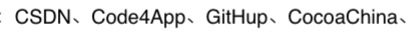
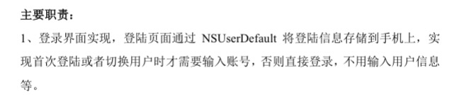
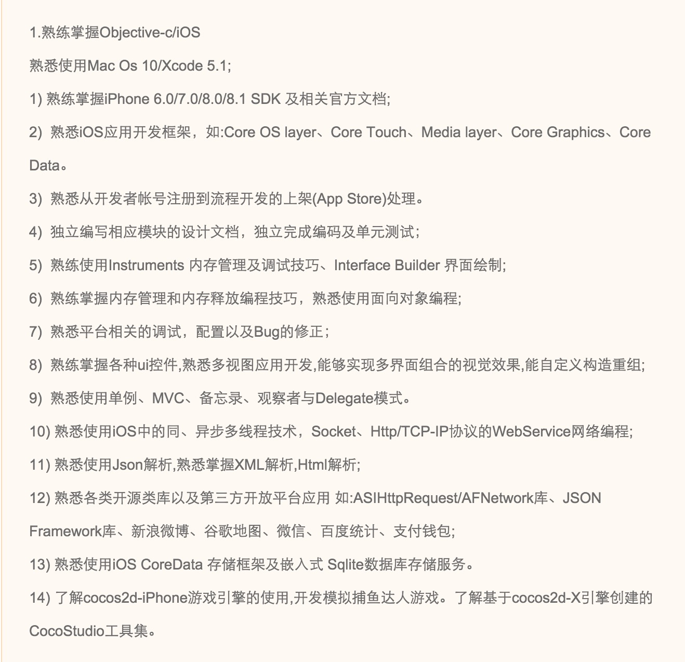
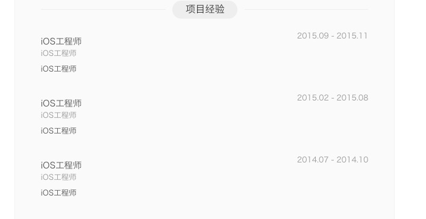

公司最近有招人扩充计划，于是乎在拉钩上发了相关的招聘信息（iOS、Java、web前端），吃惊的是iOS招聘发布不到一个小时，就收到了几十上百的简历。

先看看大多数简历的内容：

1. **有人在简历中写到，经常逛如下论坛**

	

   我想知道 GitHup 是什么？
   
当然还有各种 `ios` `IOS` `Ios` ,好吧，是我有强迫症，出现这样的一律不能要。

2. **还有人说有多个上线项目，结果：**
	
	
	这样我说什么才好！

3. **千篇一律的说辞：**

	

    当然还有各种 “精通...”，实在不忍直视

4. **三年经验？**

	

5. **请问经验呢？**

	

6. **薪资**

说到薪资大家倒也是毫不客气，刚毕业的iOS开发，要价都是10k起

这让我不禁想到了前段时间在知乎上比较火的一个帖子[如何评价 iOS 开发者的批量化生产](https://www.zhihu.com/question/38703692)。
共同点：

+ 户籍几乎都是河南
+ 上家几乎都是外包公司
+ 有不少人的上家公司或者项目竟然相同

还有一件更有趣的事情，有个面试者的项目竟然是我在我上家公司的项目。

---
看到iOS行业乱象如此，有点百感交集。以这样的态度对待工作的人想必总有一天会被淘汰吧。
